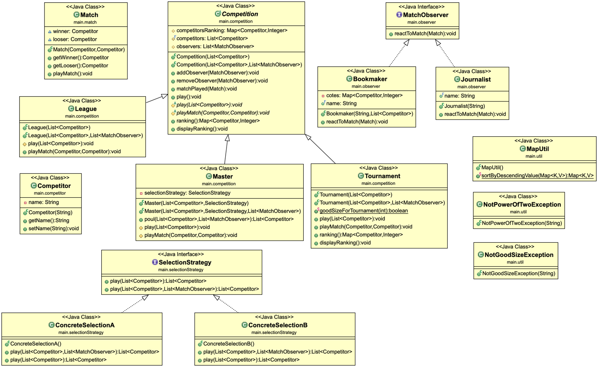
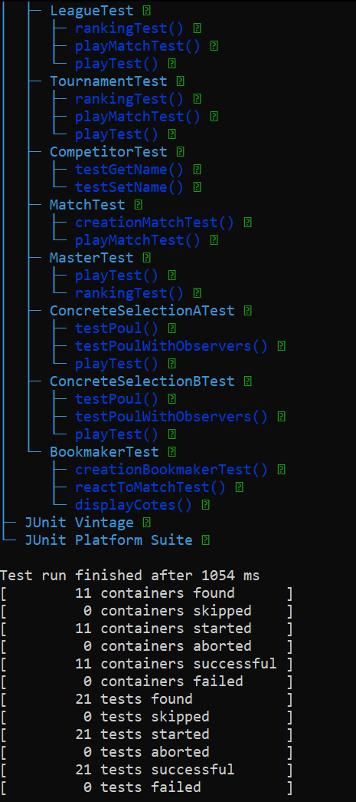

# Projet v3 : Compétitions Sportives

> Binôme : Théo Crespo Arredondo et Abir Bezzazi


- [Projet v3 : Compétitions Sportives](#projet-v3--compétitions-sportives)
- [Introduction au projet et ses objectifs](#introduction-au-projet-et-ses-objectifs)
- [Rubrique ‘HowTo’](#rubrique-howto)
  - [Récupérer les sources du projet depuis notre dépôt](#récupérer-les-sources-du-projet-depuis-notre-dépôt)
  - [Générer la documentation](#générer-la-documentation)
  - [Compiler et exécuter les sources](#compiler-et-exécuter-les-sources)
  - [Compiler les tests](#compiler-les-tests)
  - [Exécuter les tests](#exécuter-les-tests)
  - [Générer et exécuter l’archive (.jar) du projet](#générer-et-exécuter-larchive-jar-du-projet)
  - [Présentation d’éléments de code saillants](#présentation-déléments-de-code-saillants)
  - [UML](#uml)
  - [JUnit](#junit)
  - [Arboresence du projet v3](#arboresence-du-projet-v3)
# Introduction au projet et ses objectifs

Les compétitions sportives sont la confrontation d’un groupe de compétiteur ou d’équipe. Quand la confrontation se passe entre deux compétiteurs ou équipe c’est simple il suffit d’organiser un match mais quand le groupe de compétiteur ou d’équipe augmente l’organisation devient importante et c’est pour départager tous ces adversaires qu’on crée des compétitions pour organiser ces confrontations.   
Dans ce projet nous avons proposé une conception, un programme et la suite de tests associé pour simuler un ensemble types de compétitions avec une liste de compétiteurs chacun des types de compétitions propose un type d’organisation pour départager les différents compétiteurs. 

Les objectifs de ce projet sont :
- Manipuler GitLab en profondeur
- Mettre en pratique le processus de TDD
- L'utilisation des Mocks et l'héritage dans les Tests
- Mettre en pratique les patrons de conception
- Suivre les principes SOLID entre autres
  

# Rubrique ‘HowTo’


## Récupérer les sources du projet depuis notre dépôt

1. Se placer dans le Terminal.
2. Taper la commande suivante :
   
```
git clone https://gitlab-etu.fil.univ-lille.fr/abir.bezzazi.etu/bezzazi-crespoarredondo-coo.git
```

## Générer la documentation

1. Placez-vous dans le dossier src/ se trouvant à la racine du projet.
2. Tapez la commande ci-dessous pour la génération de la documentation du dossier main :
   ```
   javadoc -d ../docjav -subpackages main 
   ```
   
## Compiler et exécuter les sources

1. Se placer dans le dossier src.
2. Entrer la commande suivante :
```
javac ./*/*.java -d ../out2 && cd ../out2 && java main.Main && cd ../src
```
## Compiler les tests

1. Se placer dans le dossier src.
2. Entrer la commande suivante :
```
cd test && javac -cp ../../out:../../lib/junit-platform-console-standalone-1.9.1.jar  main/*/*/*.java -d ../../out/test && cd ..
```

## Exécuter les tests

1. Se placer dans le dossier src.
2. Entrer la commande suivante :
```
java -jar ../lib/junit-platform-console-standalone-1.9.1.jar --class-path ../out2/test:../out2 --select-class main.competition.LeagueTest --select-class main.competition.TournamentTest --select-class main.competition.CompetitionTest --select-class main.competitor.CompetitorTest --select-class main.match.MatchTest --select-class main.competition.MasterTest --select-class main.selectionStrategy.ConcreteSelectionATest --select-class main.selectionStrategy.ConcreteSelectionBTest --select-class main.selectionStrategy.SelectionTest --select-class main.observer.BookmakerTest
```

## Générer et exécuter l’archive (.jar) du projet
1. Se placer dans le out2 (le dossier ou il y a les .class)
2. Pour générer : ```jar vcfe classes.jar main.Main .```
3. Pour exécuter : ```java -jar classes.jar  ```

## Présentation d’éléments de code saillants
- Stockage des points :Pendant la conception nous avons trouvé que la question de comment nous allions stocker les points de chaque compétiteur sans en connaitre le nombre intéressant premièrement nous avions penser a ce que les points de chaque joueur soit stocker soit un attribue de la class compétiteur et puis nous avons réfléchie à la possibilité que ce joueur participe à plusieurs compétitions en même temps   et nous avons donc décider d’utiliser un dictionnaire (une hash map de java) que nous actualisons a chaque fois qu’un compétiteur gagne des points.
- Organisation des tours des tournois (Tournament ) :L’ors de la conception de la fonction play qui lancer et organise les match de tournament on ne sais pas encore comment organiser des match et des tour sans savoir combien de compétiteur on a donc penser a utiliser le fait qu’on sache que le nombre de compétiteur soit une puissance de 2pour que si il y 2^n compétiteur  il y ai bien n match sachant que comme les match se font dans notre cas en 1 vs 1.
- Utilisation du patron de conception Stratégie (Strategy Pattern) pour les différentes méthodes de selection qu'un Master peut avoir.
- Utilisation du patron de conception Observer (Observer Pattern) pour gérer les differents classes qui peuvent réagir à un match. On à decider de créer une liste d'observers et l'utiliser dans les matches a fin d'avoir une faciliter à ajouter et supprimer de notre liste les observers souhaités.
- Pour les Tests on a utiliser la Factory methode pour tester les sous-classes ainsi que vérifier l'appel de fonction.
- On a tenu à bien suivre les principes SOLID pour avoir une bonne organisation de code.

## UML


## JUnit


## Arboresence du projet v3
```
bezzazi@MacBook-Pro-de-bezzazi bezzazi-crespoarredondo-coo % tree
.
├── README.md
├── bezzazi-crespoarredondo-coo.iml
├── img
│   ├── JUnit.png
│   └── umlV3.png
├── lib
│   └── junit-platform-console-standalone-1.9.1.jar
└── src
    ├── main
    │   ├── Main.java
    │   ├── competition
    │   │   ├── Competition.java
    │   │   ├── League.java
    │   │   ├── Master.java
    │   │   └── Tournament.java
    │   ├── competitor
    │   │   └── Competitor.java
    │   ├── match
    │   │   └── Match.java
    │   ├── observer
    │   │   ├── Bookmaker.java
    │   │   ├── Journalist.java
    │   │   └── MatchObserver.java
    │   ├── selectionStrategy
    │   │   ├── ConcreteSelectionA.java
    │   │   ├── ConcreteSelectionB.java
    │   │   └── SelectionStrategy.java
    │   └── util
    │       ├── MapUtil.java
    │       ├── NotGoodSizeException.java
    │       └── NotPowerOfTwoException.java
    └── test
        └── main
            ├── competition
            │   ├── CompetitionTest.java
            │   ├── LeagueTest.java
            │   ├── MasterTest.java
            │   └── TournamentTest.java
            ├── competitor
            │   └── CompetitorTest.java
            ├── match
            │   └── MatchTest.java
            ├── mock
            │   ├── MockCompetition.java
            │   ├── MockLeague.java
            │   └── MockMatch.java
            ├── observer
            │   └── BookmakerTest.java
            └── selectionStrategy
                ├── ConcreteSelectionATest.java
                ├── ConcreteSelectionBTest.java
                └── SelectionTest.java

18 directories, 34 files
```
